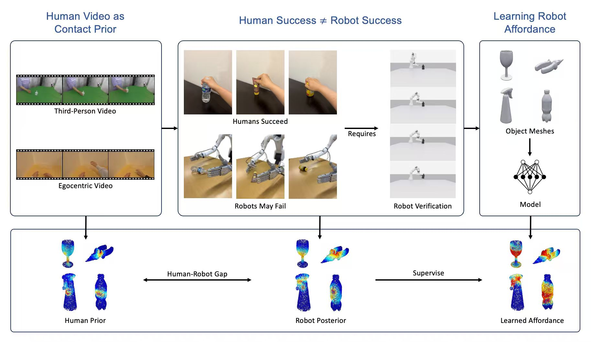
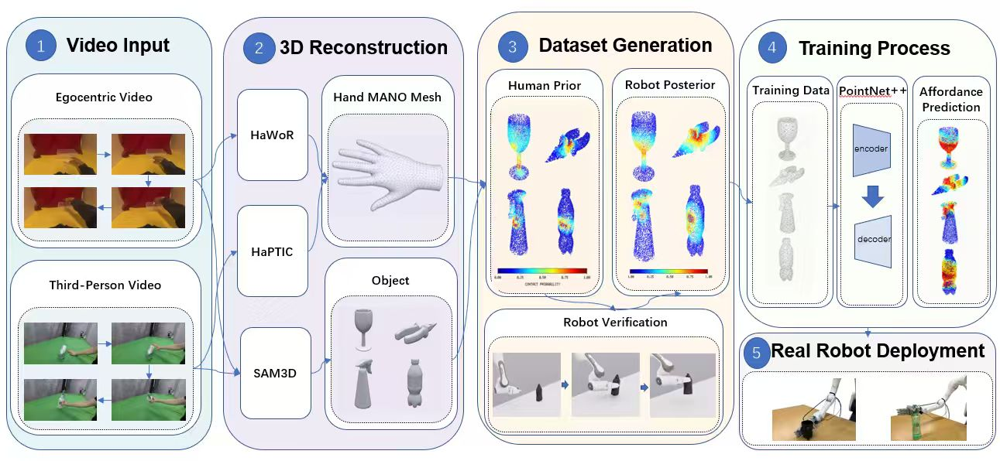

# V2AP: Video-to-Affordance-to-Pose

> **Learning robot grasp affordances from human hand-object interaction videos — no depth sensor, no object calibration, no robot demonstrations needed.**

[[Paper](#)] &nbsp; [[Project Page](#)] &nbsp; [[HuggingFace Dataset](https://huggingface.co/UCBProject)]

---



---

## About the Paper

V2AP is accepted to **[Conference TBD]**.

**Authors:** [Author 1](#), [Author 2](#), [Author 3](#)

**Key Insight:** Human grasping videos encode rich contact information. However, human success ≠ robot success — we explicitly bridge the **Human-Robot Gap** by using robot simulation to filter human priors into robot-feasible affordance labels.

---



*V2AP pipeline: (1) Video Input → (2) 3D Reconstruction (HaWoR + HaPTIC + SAM3D) → (3) Dataset Generation (Human Prior + Robot Posterior) → (4) PointNet++ Training → (5) Real Robot Deployment.*

---

## Before Start

### Download Data & Weights

All datasets and pretrained checkpoints are hosted on HuggingFace. Run the setup script to download them:

```bash
python setup_weights.py
```

Or download manually:

```bash
# Pretrained affordance model weights
huggingface-cli download UCBProject/Affordance2Grasp-Weights --local-dir weights/

# Processed contact prior dataset (human prior + robot posterior)
huggingface-cli download UCBProject/Affordance2Grasp-EgoDex --repo-type dataset --local-dir data_hub/ProcessedData/
```

The public repository does **not** include large datasets, generated experiment results, or pretrained checkpoints. Expected workspace layout:

```
V2AP/
├── data_hub/
│   ├── ProcessedData/      # downloaded from HuggingFace
│   │   ├── training_fp/    # robot-verified contact labels (HDF5)
│   │   └── human_prior_fp/ # aggregated human contact prior (HDF5)
│   └── meshes/             # object meshes (OBJ format)
├── weights/                # pretrained model checkpoints
├── output/                 # grasp candidates, eval results (generated)
└── ...
```

---

## Dependencies

This code has been tested on **Ubuntu 22.04**, **CUDA 12.1**, **Python 3.10**, and **PyTorch 2.0+**.

### 1. Core Environment

```bash
conda create -n v2ap python=3.10
conda activate v2ap
pip install -r requirements.txt
```

### 2. Isaac Sim (for simulation & evaluation only)

Install **Isaac Sim 4.x** following the [official guide](https://docs.isaacsim.omniverse.nvidia.com/latest/installation/download.html). Then install cuRobo inside the Isaac Sim Python environment:

```bash
# Inside Isaac Sim python env
./python.sh -m pip install curobo
```

Set the path in `.env`:

```bash
cp .env.example .env
# Edit .env: set ISAAC_SIM_PATH=/path/to/isaac-sim
```

### 3. External Dependencies (for data pipeline only)

These are only needed if you want to re-run the full data generation pipeline from scratch:

```bash
bash scripts/install_hawor.sh          # HaWoR: hand reconstruction (CC-BY-NC-ND)
bash scripts/install_haptic.sh         # HaPTIC: hand pose estimation
bash scripts/install_foundationpose.sh # FoundationPose: object pose (NVIDIA non-commercial)
```

> ⚠️ **MANO model**: HaWoR requires MANO body model files. Register at [mano.is.tue.mpg.de](https://mano.is.tue.mpg.de/) and place `MANO_RIGHT.pkl` / `MANO_LEFT.pkl` under `third_party/hawor/data/body_models/mano/`.

---

## Repository Structure

```
V2AP/
├── 📁 model/              # PointNet++ affordance model (training & evaluation)
├── 📁 inference/          # Inference: affordance → grasp pose → execute
├── 📁 evaluation/         # Isaac Sim evaluation framework
├── 📁 sim/                # Isaac Sim scripts + cuRobo motion planning
├── 📁 data/               # Data pipeline: depth, hand tracking, contact alignment
├── 📁 tools/              # Candidate generation, visualization, USD conversion
├── 📁 real_robot/         # Real robot demo (Dexmate Vega + Sharpa HA4)
│   ├── 📁 demo/phase1/    # Scripted grasps per object
│   └── 📁 demo/phase2/    # Affordance-driven automation
├── 📁 scripts/            # Install scripts for external dependencies
├── 📁 third_party/        # Submodules: mega-sam, ml-depth-pro
├── 📁 Repo_Image/         # README figures
├── config.py              # Global path config (reads from .env)
├── setup_weights.py       # Download weights from HuggingFace
├── requirements.txt
├── LICENSE                # MIT (applies to V2AP code only)
└── THIRD_PARTY.md         # Third-party dependency licenses
```

---

## Quick Start: Inference on Your Own Object

Given an object mesh (`.obj`), predict affordance and generate grasp poses:

```bash
conda activate v2ap

# Step 1: Predict contact affordance + generate grasp candidates
python inference/grasp_pose.py \
    --mesh examples/demo/chips_can/mesh.obj \
    --checkpoint weights/v2ap_affordance.pth \
    --out output/chips_can/

# Step 2: Visualize grasp candidates
python tools/vis_grasp_candidates.py --session output/chips_can/
```

Download the demo object:

```bash
bash scripts/download_demo_data.sh
```

---

## Training Pipeline

### Step 1: Data Collection (skip if using downloaded data)

Generate human-robot contact alignment from video datasets:

```bash
# Depth + intrinsics (third-person)
python data/batch_depth_pro.py --dataset dexycb --out data_hub/ProcessedData/third_depth/

# Hand pose (egocentric)
python data/batch_hawor.py --dataset egodex --out data_hub/ProcessedData/ego_mano/

# Object pose
python tools/batch_obj_pose.py --dataset dexycb --out data_hub/ProcessedData/obj_poses/

# Align MANO + object pose → contact labels
python data/batch_align_mano_fp.py \
    --dataset dexycb \
    --out data_hub/ProcessedData/training_fp/ \
    --n-workers 8
```

### Step 2: Train Affordance Model

```bash
cd model
python train.py \
    --data-dir ../data_hub/ProcessedData/training_fp/ \
    --prior-dir ../data_hub/ProcessedData/human_prior_fp/ \
    --output-dir ../output/checkpoints/ \
    --epochs 100 \
    --batch-size 32
```

### Step 3: Evaluate in Simulation

```bash
# Generate PDM grasp candidates for all objects
python tools/batch_pdm_candidates.py \
    --prior-dir data_hub/ProcessedData/human_prior_fp/ \
    --mesh-dir data_hub/meshes/ \
    --out output/candidates/

# Evaluate in simulation
python tools/run_round_eval.py \
    --checkpoint output/checkpoints/best.pth \
    --candidates output/candidates/ \
    --policy v2ap \
    --n-trials 10
```

---

## Real Robot Deployment

See [`real_robot/README.md`](real_robot/README.md) for the complete guide.

**Hardware:** Dexmate Vega arm + SharpaWave HA4 hand + ZED camera

```bash
# Phase 1: Scripted grasps (no affordance inference needed)
source real_robot/setup_local.sh
python real_robot/demo/phase1/run_grasp.py --object-name chips_can

# Phase 2: Affordance-driven automation
python real_robot/demo/phase2/run_auto_grasp.py
```

---

## Citation

If you find this work useful, please consider starring 🌟 this repo and citing 📑 our paper:

```bibtex
@inproceedings{v2ap2025,
  title     = {V2AP: Learning Robot Grasp Affordances from Human Hand-Object Interaction Videos},
  author    = {Author 1 and Author 2 and Author 3},
  booktitle = {[Conference]},
  year      = {2025},
}
```

---

## Questions

For questions or issues, please open a [GitHub Issue](https://github.com/stzabl-png/V2AP/issues). We encourage using GitHub issues rather than email, as your questions may help others.
